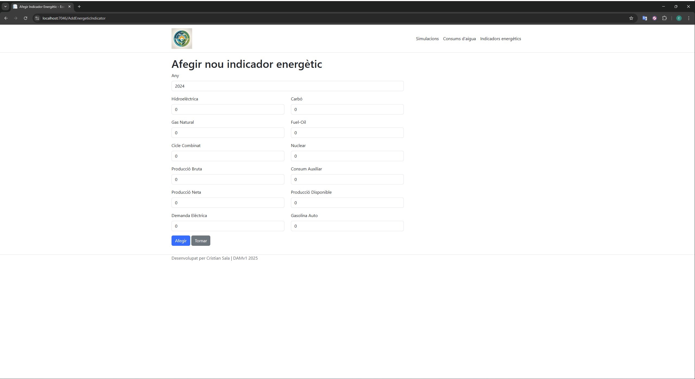

# T4-PR1-CristianSala

## Project overview
### Mobile view has a navbar expand feature


### Desktop view




Already had it done prior to the exercise modification, thus it has the original requirements 

## Class diagram


## SonarCube-SonarScanner
### Commands to run after settig up a project
```batch 
dotnet sonarscanner begin /k:"T4PR1" /d:sonar.host.url="http://localhost:9000" /d:sonar.login="sqp_f5866235d6cd48bfaade4cd83455604bab17bd84"
dotnet build
dotnet sonarscanner end /d:sonar.login="sqp_f5866235d6cd48bfaade4cd83455604bab17bd84"
```

### Results


